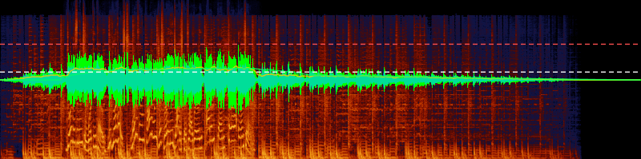
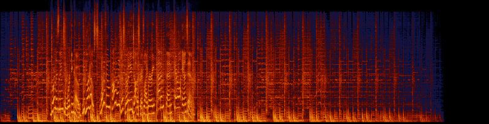
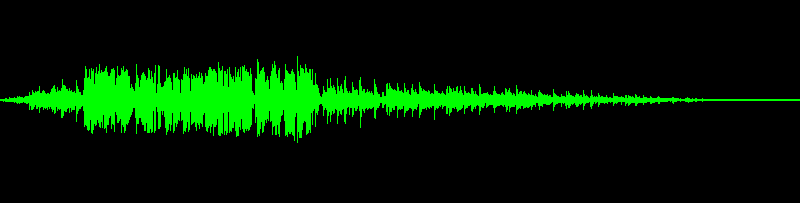
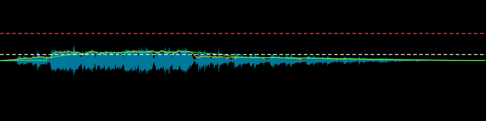

# Spectral Display

WebGPU-accelerated audio visualization for React. Renders spectrograms, waveforms, and BS.1770-4 loudness metrics from raw audio samples.



## Features

- GPU-accelerated spectrogram via WebGPU compute shaders (Cooley-Tukey FFT)
- Waveform rendering with min/max peak envelope
- BS.1770-4 loudness measurement — momentary, short-term, and integrated LUFS
- Configurable frequency scales: linear, log, mel, ERB
- Built-in colormaps (lava, viridis) with custom colormap support
- BS.1770-4 true peak measurement via 4x oversampling
- Configurable computation toggles — disable spectrogram, loudness, or true peak independently
- Streaming architecture — processes audio in chunks without loading entire files into memory

## Install

```
npm install spectral-display
```

Peer dependencies: `react >= 18`, `react-dom >= 18`

## Quick Start

```tsx
import { useSpectralCompute, SpectrogramCanvas, WaveformCanvas, LoudnessCanvas } from "spectral-display";

function AudioDisplay({ device, metadata, readSamples }) {
	const computeResult = useSpectralCompute({
		metadata,
		query: { startMs: 0, endMs: 30000, width: 800, height: 200 },
		readSamples,
		config: { device, frequencyScale: "mel", colormap: "lava" },
	});

	return (
		<div style={{ position: "relative", width: 800, height: 200 }}>
			<SpectrogramCanvas computeResult={computeResult} />
			<div style={{ position: "absolute", inset: 0 }}>
				<WaveformCanvas computeResult={computeResult} />
			</div>
			<div style={{ position: "absolute", inset: 0 }}>
				<LoudnessCanvas computeResult={computeResult} />
			</div>
		</div>
	);
}
```

Pass your own `GPUDevice` via `config.device` to share it across components. If omitted, the hook acquires one automatically.

The `readSamples` callback provides audio data on demand:

```ts
const readSamples = (channel: number, sampleOffset: number, sampleCount: number) => {
	// Return a Float32Array of samples for the given channel and range
	return Promise.resolve(channelData[channel].subarray(sampleOffset, sampleOffset + sampleCount));
};
```

## Visualizations

### Spectrogram

Frequency content over time. Supports linear, log, mel, and ERB frequency scales with configurable FFT size, dB range, and colormap.



### Waveform

Peak amplitude envelope showing min/max sample values per time column.



### Loudness

BS.1770-4 loudness metrics: RMS envelope (filled), momentary LUFS (400ms window), short-term LUFS (3s window), and integrated LUFS (horizontal dashed line). LUFS values are mapped to amplitude (`10^(lufs/20)`) so they visually correspond to the waveform scale. True peak is shown as a red dashed horizontal line at the interpolated peak amplitude.



## API

### `useSpectralCompute(options: SpectralOptions): ComputeResult`

The main hook. Manages the GPU engine lifecycle, runs the processing pipeline, and returns results reactively.

#### SpectralOptions

| Field         | Type                                                | Description                       |
| ------------- | --------------------------------------------------- | --------------------------------- |
| `metadata`    | `SpectralMetadata`                                  | Audio file properties             |
| `query`       | `SpectralQuery`                                     | Time range and output dimensions  |
| `readSamples` | `(channel, offset, count) => Promise<Float32Array>` | Callback to provide audio samples |
| `config`      | `Partial<SpectralConfig>`                           | Optional processing configuration |

#### SpectralMetadata

| Field            | Type                    | Description                                           |
| ---------------- | ----------------------- | ----------------------------------------------------- |
| `sampleRate`     | `number`                | Sample rate in Hz                                     |
| `sampleCount`    | `number`                | Total samples per channel                             |
| `channelCount`   | `number`                | Number of audio channels                              |
| `channelWeights` | `ReadonlyArray<number>` | Optional BS.1770-4 channel weights (default: all 1.0) |

#### SpectralQuery

| Field     | Type     | Description                |
| --------- | -------- | -------------------------- |
| `startMs` | `number` | Start time in milliseconds |
| `endMs`   | `number` | End time in milliseconds   |
| `width`   | `number` | Output width in pixels     |
| `height`  | `number` | Output height in pixels    |

#### SpectralConfig

All fields are optional — defaults are applied automatically.

| Field            | Type                           | Default     | Description                                       |
| ---------------- | ------------------------------ | ----------- | ------------------------------------------------- |
| `fftSize`        | `number`                       | `4096`      | FFT window size (power of 2)                      |
| `frequencyScale` | `FrequencyScale`               | `"log"`     | `"linear"`, `"log"`, `"mel"`, or `"erb"`          |
| `dbRange`        | `[number, number]`             | `[-120, 0]` | Spectrogram dB range [min, max]                   |
| `colormap`       | `string \| ColormapDefinition` | `"lava"`    | `"lava"`, `"viridis"`, or custom colormap         |
| `waveformColor`  | `[number, number, number]`     | Auto        | RGB color for waveform rendering                  |
| `device`         | `GPUDevice`                    | Auto        | WebGPU device (acquired automatically if omitted) |
| `signal`         | `AbortSignal`                  | Internal    | External abort signal for cancellation            |
| `spectrogram`    | `boolean`                      | `true`      | Enable spectrogram GPU computation                |
| `loudness`       | `boolean`                      | `true`      | Enable K-weighting and LUFS computation           |
| `truePeak`       | `boolean`                      | `true`      | Enable BS.1770-4 true peak measurement            |

#### ComputeResult

Discriminated union with `status` field:

- `{ status: "idle" }` — no computation started
- `{ status: "error", error: Error }` — pipeline failed
- `{ status: "ready", spectrogramTexture, waveformBuffer, waveformPointCount, loudnessData, options }` — results available

### Components

#### `<SpectrogramCanvas computeResult={computeResult} />`

Renders the spectrogram texture to a canvas via GPU blit.

#### `<WaveformCanvas computeResult={computeResult} color={[r, g, b]} />`

Renders the waveform envelope via GPU compute. `color` is optional RGB (0-255).

#### `<LoudnessCanvas computeResult={computeResult} />`

Renders loudness metrics on a 2D canvas. Optional boolean props to toggle each visualization:

| Prop          | Default  | Description                       |
| ------------- | -------- | --------------------------------- |
| `rmsEnvelope` | `true`   | RMS amplitude envelope fill       |
| `momentary`   | `false`  | 400ms momentary LUFS line         |
| `shortTerm`   | `false`  | 3s short-term LUFS line           |
| `integrated`  | `true`   | Integrated LUFS horizontal line   |
| `truePeak`    | `false`  | True peak amplitude line          |
| `colors`      | Built-in | Override colors per visualization |

All components accept a `ref` prop for canvas element access.

## Browser Requirements

- **WebGPU** — required for spectrogram and waveform rendering. Check `navigator.gpu` for support.
- **`scheduler.yield()`** — optional. Used for cooperative yielding during processing. Falls back to `setTimeout` if unavailable.

## License

ISC
